# Bits and Buy

Bits and Buy is a full-stack e-commerce application designed to provide a seamless and engaging online shopping experience. This project showcases a modern web application built with a React frontend and a Node.js backend, featuring a wide range of functionalities from user authentication to order processing.

## Screenshots

Here are some screenshots of the application in action:

| 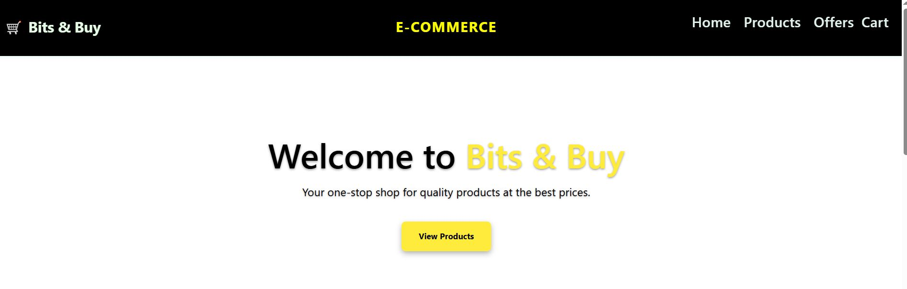 | 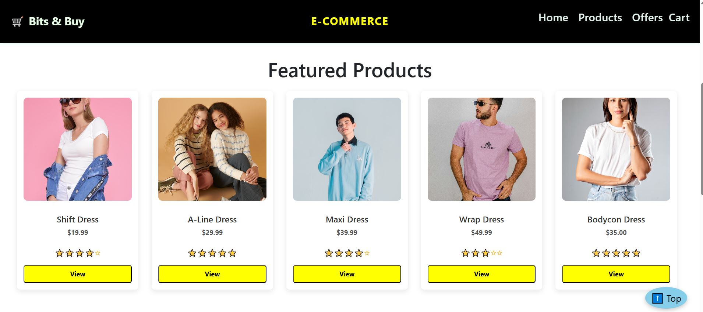 | 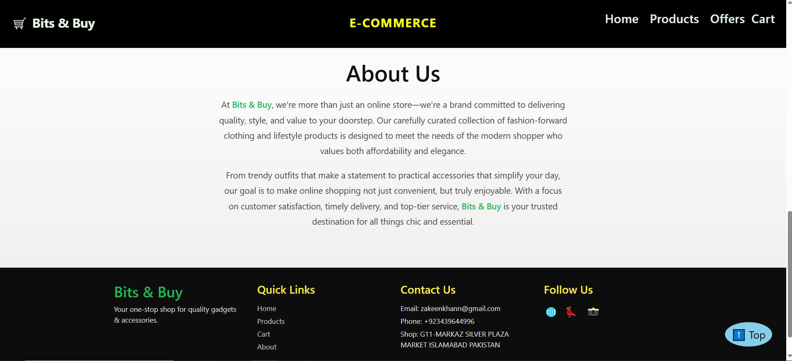 |
| :-------------------------------------: | :---------------------------------------: | :-------------------------------------------: |
|                **Home Page**            |              **Product Page**             |            **Product Details**                |

| 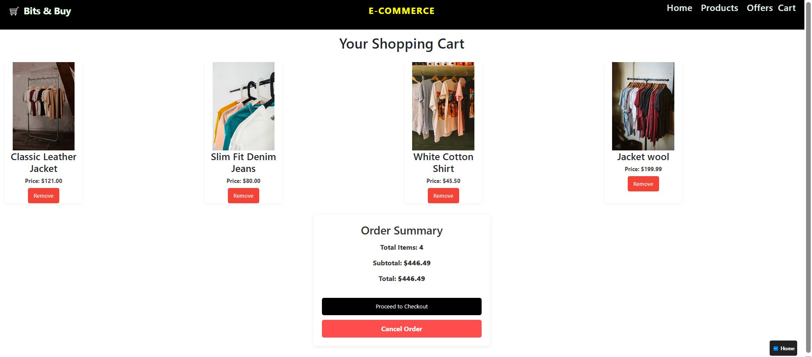 | 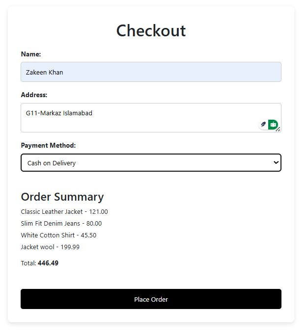 | 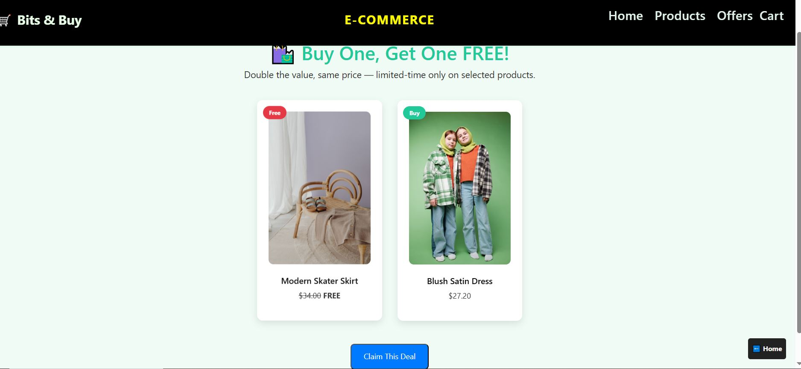 |
| :----------------------------: | :------------------------------------: | :-----------------------------------------------: |
|              **Cart**          |                **Checkout**            |             **Special Offers**                    |

| 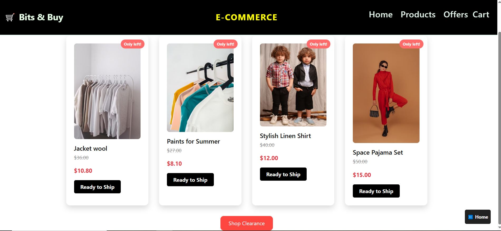 | 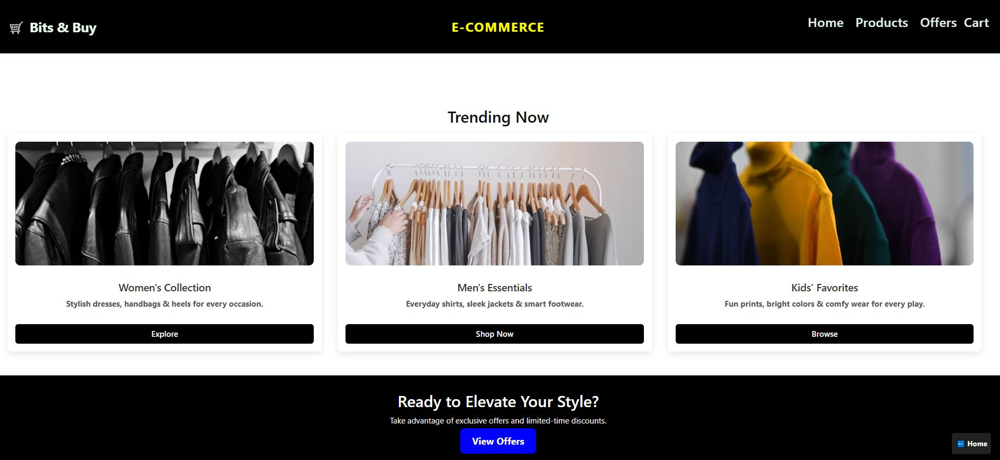 | 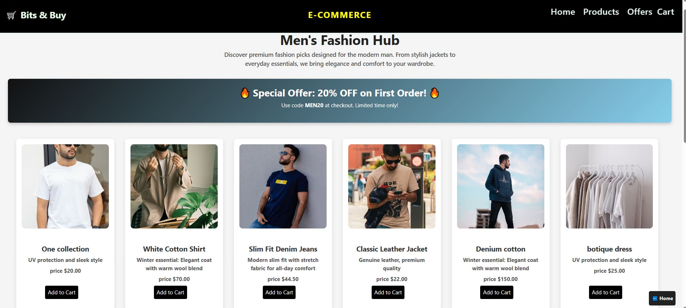 |
| :--------------------------------------: | :-------------------------------------: | :-------------------------------------: |
|              **Clearance**               |             **Category Page**           |             **Category Page**           |

| 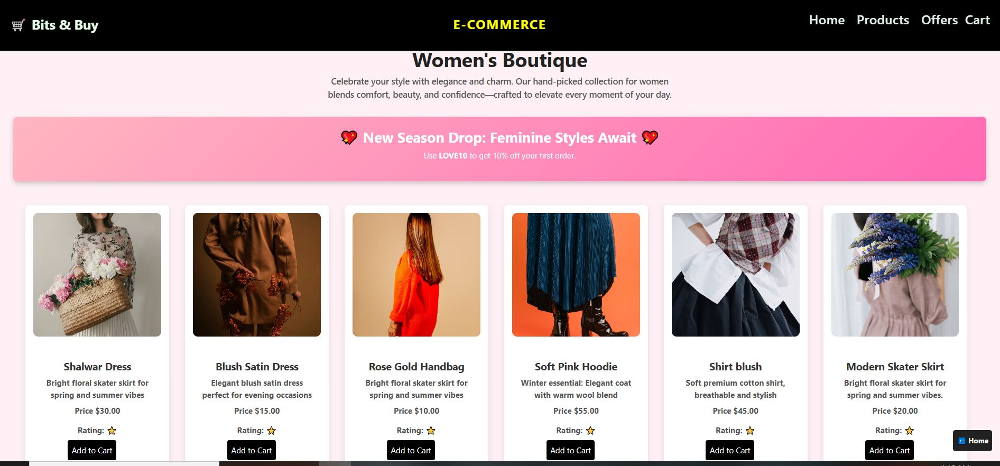 | 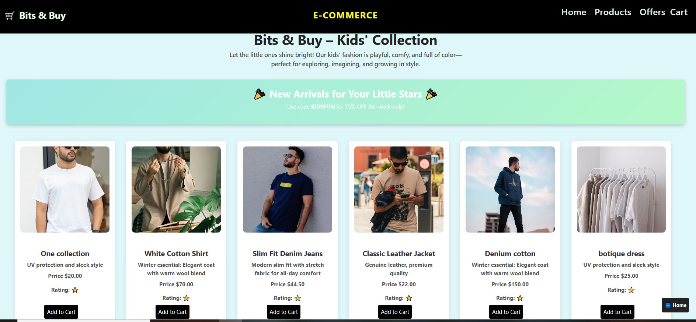 | 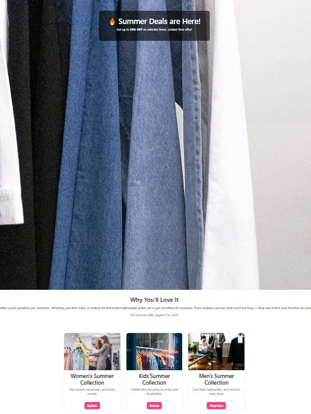 |
| :-------------------------------------: | :-------------------------------------: | :-------------------------------------: |
|             **Feature 1**               |              **Feature 2**              |              **Feature 3**              |

| 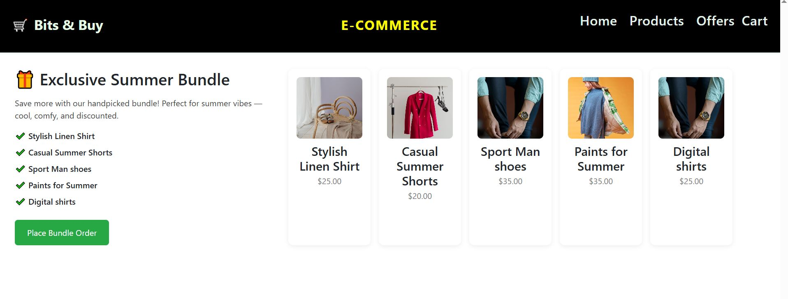 |
| :-------------------------------------: |
|             **Feature 4**               |

## Tech Stack

### Frontend

*   **Framework:** [React](https://reactjs.org/)
*   **Styling:** [Bootstrap](https://getbootstrap.com/), [Tailwind CSS](https://tailwindcss.com/)
*   **Routing:** [React Router](https://reactrouter.com/)
*   **Animations:** [Framer Motion](https://www.framer.com/motion/)
*   **HTTP Client:** [Axios](https://axios-http.com/)
*   **Notifications:** [React Toastify](https://fkhadra.github.io/react-toastify/)

### Backend

*   **Framework:** [Express.js](https://expressjs.com/)
*   **Database:** [PostgreSQL](https://www.postgresql.org/)
*   **Authentication:** [JSON Web Tokens (JWT)](https://jwt.io/), [bcryptjs](https://www.npmjs.com/package/bcryptjs)
*   **Environment Variables:** [dotenv](https://www.npmjs.com/package/dotenv)

## Features

*   User registration and login
*   Product browsing and searching
*   Shopping cart functionality
*   Secure checkout process
*   User profile management
*   Responsive design for a seamless experience across devices

## Getting Started

To get this project up and running on your local machine, follow these simple steps.

### Prerequisites

Make sure you have the following installed:
*   [Node.js](https://nodejs.org/)
*   [npm](https://www.npmjs.com/get-npm)
*   [PostgreSQL](https://www.postgresql.org/)

### Setup Instructions

1.  **Navigate to the Backend Directory and Install Dependencies:**

    Open a terminal and run the following commands:
    ```sh
    cd backend
    npm install
    ```

2.  **Navigate to the Frontend Directory and Install Dependencies:**

    In a **new terminal window**, run the following commands:
    ```sh
    cd frontend
    npm install
    ```

3.  **Set Up Environment Variables:**

    In the `backend` directory, create a `.env` file and add the necessary configuration for your database and JWT secret:
    ```
    DB_USER=your_db_user
    DB_HOST=your_db_host
    DB_DATABASE=your_db_name
    DB_PASSWORD=your_db_password
    DB_PORT=your_db_port
    JWT_SECRET=your_jwt_secret
    ```

### Running the Application

To run the application, you will need two separate terminals.

1.  **Start the Backend Server:**

    In your first terminal, from the `backend` directory, run:
    ```sh
    npm start
    ```

2.  **Start the Frontend Application:**

    In your second terminal, from the `frontend` directory, run:
    ```sh
    npm start
    ```

## How to Access

Once the application is running, you can access it at `http://localhost:3002` in your web browser.
